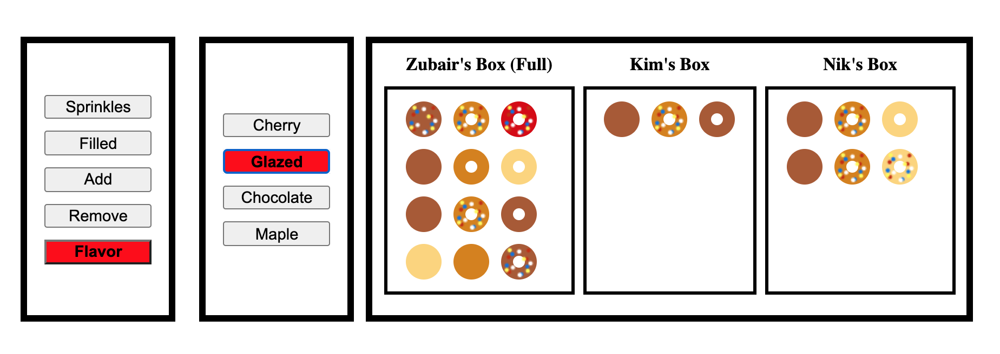

# Cruddy Voodoo

## Summary

First you do to-do and now you do voodoo!

This repo has a complete React build with various buttons to create, read, update, and delete donuts!  Your task is to create a database and build API connections to power the application. Mock data is provided to analyze the expected input object's structure.

```
src/Constants/mockData.js
```



## Getting Started

install dev dependancies with 
```
npm install
```

## Scripts

to run live dev server (This will run your client bundle via RAM and automatically make changes/refresh your browser on save)
```
npm run dev
```

to build dev bundle
```
npm run build
```

to start server
```
npm start
```

